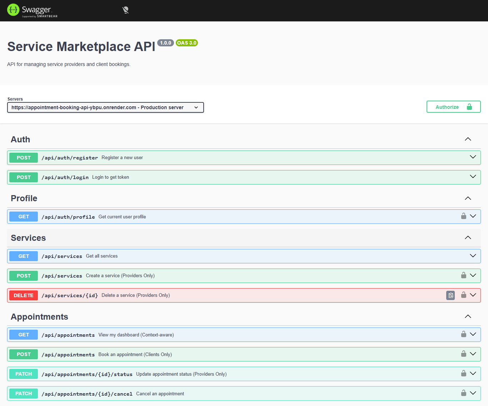

# Service Marketplace API

## App

## About

This project is a comprehensive backend system for a professional service market. It enables a workflow between **Appointment Service Providers** and **Clients**. The API handles everything from user onboarding to complex appointment lifecycles.

Key features include:
- **RBAC (Role-Based Access Control):** Distinct permissions for Clients and Providers.
- **Service Hub:** Providers can list, describe, and price their professional services.
- **Booking Engine:** A state-managed system for scheduling, confirming, and cancelling appointments.

## API Design Document

The full technical specification and endpoint documentation can be found in the [Swagger Documentation](./swagger.yaml).

## Built With

- Javascript (Node.js)
- Express.js
- Sequelize ORM
- PostgreSQL
- JWT (JsonWebToken)
- Swagger UI

### Prerequisites

Knowledge about Backend Development:
- RESTful API architecture
- Relational Database Management (PostgreSQL)
- Express.js Middleware logic
- JSON Web Token (JWT) authentication

## Clone project

- To get a local copy up and running, follow these simple steps.
- Clone this repository with `https://github.com/SalahVincent/Appointment-Booking-API` using your terminal or command line.

## Command line steps

- $ `git clone https://github.com/SalahVincent/Appointment-Booking-API`
- $ `git checkout dev`

## Start App

- Run `npm install` to install the necessary dependencies.
- Setup your `.env` file with your `DATABASE_URL` and `JWT_SECRET`.
- Run `npm start` to launch the server.
- Visit `http://localhost:3000/api-docs` to view the interactive UI.

## Live Site

[Live Demo Link](https://appointment-booking-api-ybpu.onrender.com/api-docs/)

## Author

**Vincent Salah**

- GitHub: [@SalahVincent](https://github.com/SalahVincent)

## Show your support

Give a ⭐️ if you like this project!